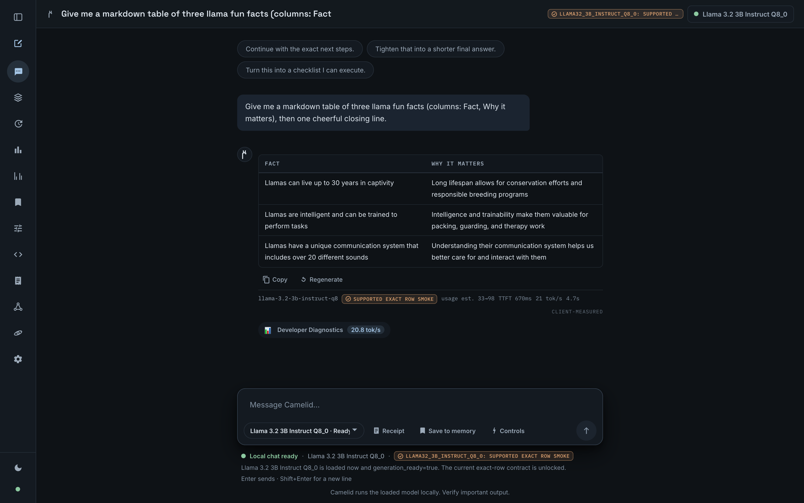

# Camelid

[![CI][ci-badge]][ci-workflow]

Camelid is a Rust-native local LLM inference engine focused on GGUF inference, correctness, and local performance.

It loads GGUF models directly, exposes an OpenAI-style local API, and is built around reproducible benchmark evidence instead of hype.

Camelid is not a wrapper around Ollama or llama.cpp. It is its own inference/runtime project written in Rust.



The local web frontend: a dark, collapsed-rail chat surface that enables chat only for model rows the compatibility contract recognizes.

## Why Camelid?

- **Rust-native inference** — the tokenizer, GGUF loader, CPU kernels, and Metal GPU path are all implemented in this repository; one static binary, no Python.
- **Direct GGUF loading** — point it at a `.gguf` file; no conversion or import step.
- **OpenAI-style local API** — `/v1/chat/completions` and `/v1/completions` with streaming, served locally.
- **Correctness-focused development** — optimized paths are gated on token-for-token parity with a reference implementation before they ship; unsupported configurations fail closed with typed errors instead of guessing.
- **Proof-carrying inference** — any request can emit a sealed *parity receipt*: the exact GGUF (by SHA-256), the exact input, and the exact tokens produced, independently re-verifiable on your own machine against llama.cpp — including 7B receipts on a 16 GB Mac. A [conformance suite](docs/CONFORMANCE.md) measures any local runtime by one ruler: determinism, cross-runtime agreement, tokenizer parity, and provability.
- **Reproducible benchmark evidence** — every published number comes from a committed evidence bundle with raw logs, commands, and versions. No raw log, no claim.
- **Apple Silicon performance work** — a Metal-resident path (GPU prefill, GPU decode with on-GPU greedy sampling) that is measured against llama.cpp and MLX-LM on the same host, with wins, ties, and losses all stated.
- **Fast model loading on Apple Silicon** — the local server maps Q8_0 weights for the GPU to read in place rather than reading and copying them, so reloading a model is quick and peak memory stays lower.

## Status

| Feature | Status | Notes |
|---|---|---|
| GGUF loading | Working | Direct load with metadata/tensor inspection (`camelid inspect`). |
| Q8_0 inference | Working | The validated quantization. Support is per exact model row — see [`SUPPORT_MATRIX_v0.1.md`](SUPPORT_MATRIX_v0.1.md) (TinyLlama 1.1B, Llama 3.2 1B/3B, Llama 3 8B, Mistral 7B v0.3; Mixtral is validation-in-progress and fails closed). |
| Gemma 4 (exact rows) | Supported (exact rows, bounded) | From-scratch `gemma4` engine — per-layer-type sliding/global attention (GGUF `sliding_window_pattern` authoritative; E2B is 4:1), per-layer FFN widths and KV head counts, QK-norm, dual-θ RoPE, GeGLU, Per-Layer-Embeddings, cross-layer KV sharing, `<\|turn>`/`<turn\|>` chat markers with thinking-channel suppression. Camelid supports **Gemma 4 E2B-It Q8_0** and **Gemma 4 E4B-It Q8_0** as exact-row text-token-generation lanes: five-prompt greedy parity vs the pinned llama.cpp oracle (`qa/gemma4/oracle/`) on CPU **and** the Metal GPU-resident runtime, **checked bounded 512/1024/2048/4096/8192-context packs** (recall-style, oracle recall asserted at capture; full-budget CPU+GPU passes at every bucket, no recorded frontiers), a reference-exact chat template locked byte- and token-exact (`qa/gemma4/template_shapes_v1.json`, both thinking modes), and API/streaming chat behind `CAMELID_GEMMA4_SERVE` on `/v1/chat/completions` and `/v1/completions`. A Metal GPU-resident decode path (`camelid gemma4-generate-gpu`) runs the full E4B forward on the GPU at the memory-bandwidth wall. A QAT Q4_0/Q6_K wire lane is committed parity (E4B QAT basic_v1: 3/5 full + 2 frontiers). **Gemma 4 26B-A4B-It QAT Q4_0** (128-expert MoE, Q4_0 experts + Q6_K tied head) is supported as an exact-row text-token-generation lane **via the two-Mac distributed layer-sharding serve lane only** — the 13.4 GB row is memory-infeasible on a single 16 GB host. Its A4B MoE forward passes the full basic_v1 pack distributed (2/5 prompts full-budget token-identical to the reference, 3/5 probe-verified knife-edge frontiers; distributed output == single-node), and the distributed serve/WebUI promotion smoke is green. Multimodal input fails closed with a typed error; the Q8_0 26B A4B (26.9 GB), 31B, and MTP/drafter rows fail closed with named blockers. No family-wide claim; no model-native/larger context beyond the checked packs. |
| Gemma 4 two-Mac sharding | Experimental | `gemma4-master`/`gemma4-worker` run one Gemma 4 row split across two machines (distributed layer sharding over TCP — NOT shared memory) with a versioned handshake and per-packet checksums; distributed greedy output is asserted token-identical to single-node and to the llama.cpp oracle (`tests/gemma4_distributed_parity.rs`). Proven on two 16 GB M4 Mac minis with gemma-4-12b-it-Q8_0 (12.67 GB, memory-infeasible single-node on the primary host): 5/5 pack prompts token-identical to single-node, ~6.2-6.75 tok/s across the pair, both nodes within budget (evidence bundle in qa/evidence-bundles). The same lane now serves HTTP: with `CAMELID_GEMMA4_SERVE=1` plus `CAMELID_GEMMA4_WORKER`/`CAMELID_GEMMA4_SPLIT`, `/v1/chat/completions` and `/v1/completions` route through a persistent master shard with per-request worker sessions (wire protocol v1 unchanged) — validated on loopback (E2B) and live across the two Macs with the 12B row — chat, raw completion, SSE, and the WebUI promotion smoke all green (evidence bundles in qa/evidence-bundles). **Gemma 4 12B-It Q8_0 is supported exact-row smoke through this two-Mac lane only** (memory-infeasible on a single 16 GB host). See [`docs/gemma4-two-mac-cluster.md`](docs/gemma4-two-mac-cluster.md). |
| OpenAI-style API | Working | `/v1/chat/completions`, `/v1/completions`, `/v1/models`, plus local capability/health routes. |
| Streaming chat | Working | SSE streaming on the chat endpoint. |
| Apple Silicon Metal path | Working | GPU-resident prefill and decode, selected automatically when a Metal device is present; falls back to validated CPU paths otherwise. |
| Web frontend | Working | Local React/Vite chat surface; enables chat only for model rows the compatibility contract recognizes. |
| Parity receipts | Working | Opt-in sealed record of one request; `camelid verify-receipt` re-checks it independently against llama.cpp, including 7B receipts on a 16 GB host. |
| Other quantizations | Not supported | Fail closed in v0.1. |
| Distributed worker | Experimental | `serve-distributed` / pipeline worker-master commands exist; not part of the v0.1 support claim. |
| Ghost mode (layer streaming) | Experimental | `ghost-run` executes one transformer block at a time from a repacked file for a strict memory ceiling; trades throughput for memory, no prefetch yet. |

## Quickstart

Build:

```bash
cargo build --release
```

Serve a local GGUF model (Q8_0):

```bash
./target/release/camelid serve \
  --model /path/to/Llama-3.2-3B-Instruct-Q8_0.gguf \
  --threads 4
```

The server listens on `127.0.0.1:8181` by default. List the loaded model (its `id` comes from the GGUF metadata):

```bash
curl -s http://127.0.0.1:8181/v1/models
```

Chat (replace the model `id` with the one returned above):

```bash
curl -s http://127.0.0.1:8181/v1/chat/completions \
  -H "Content-Type: application/json" \
  -d '{
    "model": "Llama 3.2 3B Instruct",
    "messages": [{"role": "user", "content": "Say hello in one sentence."}],
    "max_tokens": 64,
    "temperature": 0
  }'
```

Add `"stream": true` for SSE streaming. To run the local web frontend:

```bash
cd frontend && npm ci && npm run dev
```

## Evidence

Camelid benchmark claims are only listed when raw logs or reproducible commands are available in the repo. If there is no raw log, there is no benchmark claim.

Same-host snapshot on one Apple M4 (10-core GPU, 16 GB), Llama 3.2 3B Instruct Q8_0, greedy sampling, three same-session rounds with alternating runtime order (medians):

| Lane | Camelid | llama.cpp (Metal) | MLX-LM (8-bit) |
| --- | ---: | ---: | ---: |
| Prefill, 601-token prompt (tok/s) | **587.3** | 543.7 | 577.9 |
| Decode, short context (tok/s) | **29.7** | 29.1 | 29.1 |

Reading boundary: this is a same-session result on one exact model row and one machine, with narrow margins — not a durable or general claim. Some lanes read below the comparators (decode at long context trails MLX-LM); deeper prompt depths are covered by single warm probes rather than protocol-grade rounds. All of it — methods, raw logs, per-round detail, and the lanes where Camelid loses — is in [`BENCHMARKS.md`](docs/benchmarks/BENCHMARKS.md) and the committed bundles under [`qa/evidence-bundles/`](qa/evidence-bundles/).

Correctness evidence (token-parity gates, per-row validation artifacts) is indexed in [`COMPATIBILITY.md`](COMPATIBILITY.md) and [`CORRECTNESS_v0.1.md`](docs/release/CORRECTNESS_v0.1.md).

### Parity receipts

A parity receipt is a verifiable record of one request: the exact GGUF (by SHA-256), the exact input, and the exact tokens produced. Opt in with `"camelid_receipt": true` on `/v1/chat/completions` or `/v1/completions`, then check it on any machine:

```bash
camelid verify-receipt receipt.json --gguf path/to/exact-model.Q8_0.gguf
```

The verifier recomputes the receipt's digest, confirms your GGUF is the named file, replays the request through Camelid, and re-runs it through llama.cpp — in two isolated passes so each model loads within one model's memory footprint, which lets a 7B receipt verify on a 16 GB Mac. Receipts only exist for deterministic (greedy) runs; sampled runs are stamped `reproducible: false` and are not verifiable. **A receipt verifies a single request; it does not change the release ledger or promote any lane.** Details: [`RECEIPTS.md`](RECEIPTS.md).

To measure any local runtime — not only Camelid — by determinism, cross-runtime agreement, tokenizer parity, and provability on the same model bytes, see the [conformance suite](docs/CONFORMANCE.md).

## Documentation

- [`SUPPORT_MATRIX_v0.1.md`](SUPPORT_MATRIX_v0.1.md) — which exact model rows are supported, and with what evidence
- [`COMPATIBILITY.md`](COMPATIBILITY.md) — the durable support contract
- [`BENCHMARKS.md`](docs/benchmarks/BENCHMARKS.md) — benchmark snapshots and claim rules
- [`RECEIPTS.md`](RECEIPTS.md) — verifiable single-request parity receipts (not a support ledger)
- [`docs/CONFORMANCE.md`](docs/CONFORMANCE.md) — measure any runtime by one ruler: determinism, cross-runtime agreement, tokenizer parity, and provability
- [`STATUS.md`](STATUS.md) — current evidence snapshot and blockers
- [`ARCHITECTURE.md`](docs/architecture/ARCHITECTURE.md) — implementation architecture
- [`RELEASE_NOTES_v0.1.md`](docs/release/RELEASE_NOTES_v0.1.md) — v0.1 release notes
- [`ROADMAP.md`](ROADMAP.md) — planned engineering sequence

Validation for code changes:

```bash
cargo fmt --all -- --check
cargo clippy --all-targets --all-features -- -D warnings
cargo test --all-targets --all-features
```

## License

Camelid is licensed under the [MIT License](LICENSE).

Camelid's tokenizer, reference compatibility layouts, and validation benchmarks are inspired by and checked against [`llama.cpp`](https://github.com/ggml-org/llama.cpp) (Copyright (c) 2023-2026 The ggml authors, MIT License). Camelid maintains its own Rust-native codebase while crediting the reference work of the `ggml` ecosystem.

[ci-badge]: https://github.com/timtoole02/Camelid/actions/workflows/ci.yml/badge.svg
[ci-workflow]: https://github.com/timtoole02/Camelid/actions/workflows/ci.yml
