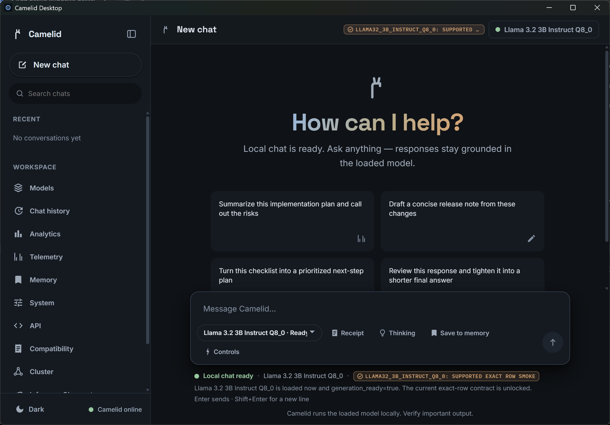

<div align="center">

# 🐪 Camelid

**A Rust-native local LLM inference engine — GGUF in, OpenAI-style API out, every claim backed by reproducible evidence.**

[![CI][ci-badge]][ci-workflow]
[](LICENSE)


</div>

Camelid loads GGUF models directly, serves them over a local OpenAI-style API, and gates every optimized path on token-for-token parity with a reference implementation. It is **not** a wrapper around Ollama or llama.cpp — the tokenizer, GGUF loader, CPU kernels, and Metal GPU path are all implemented in this repository, shipping as a single static Rust binary with no Python.


<div align="center"><sub>The local web frontend — a dark, collapsed-rail chat surface that unlocks chat only for model rows the compatibility contract recognizes.</sub></div>

---

## Install

**Two ways to run Camelid — both use the same engine and the same models. Pick what fits:**

| | 🪟 Camelid Desktop | ⚙️ Camelid engine |
|---|---|---|
| **What it is** | A native Windows app | The prebuilt `camelid` binary |
| **Best for** | Just chatting on your own PC — the easy button | Sharing on a network, the API, scripting |
| **How you chat** | A native window (no browser, no terminal) | In your **browser**, or a **server** others connect to |
| **Install** | Double-click the signed installer | Unzip and run `camelid.exe` |
| **Runs on** | Windows | Windows · macOS · Linux |

The desktop app simply wraps the same engine in a native window — same models, same support gate, same GPU acceleration. **If you just want to chat, get the desktop app. If you want to share it or use the API, get the engine.**

### 🪟 Camelid Desktop (Windows) — easiest

The simplest way to run a model locally: a native app, no browser tab, no command line.



<div align="center"><sub>Camelid Desktop on Windows — the same chat surface in a native window, with the supported Llama 3.2 3B row loaded and ready.</sub></div>

1. Download the **Camelid Desktop installer** (`Camelid.Desktop_<version>_x64-setup.exe`) from the [latest release](https://github.com/timtoole02/Camelid/releases/latest).
2. Double-click it and follow the prompts. It's **code-signed** (verified publisher); if Windows SmartScreen warns on a fresh download, click *More info → Run anyway*.
3. Launch **Camelid Desktop** from the Start menu. It starts the engine for you and opens the chat window — pick a model to download, and chat.

Installs just for you under `%LOCALAPPDATA%\Camelid Desktop` — **no admin rights needed**. GPU acceleration works on any NVIDIA card with only the normal driver (the CUDA runtime is bundled); no GPU, it runs on the CPU.

### ⚙️ Camelid engine — run it in a browser, or serve it to share

The prebuilt binary, with the web UI baked in. Run it to chat in your **browser**, or serve it so **other people or apps** can connect over an OpenAI-style API — on Windows, macOS, or Linux. Get it from the [latest release](https://github.com/timtoole02/Camelid/releases/latest).

**Windows (x86_64):**

1. Download **`camelid-windows-x64.zip`** and right-click → **Extract All…** to a folder (your Desktop is fine).
2. Run **`.\camelid.exe serve`** in a terminal (or double-click `camelid.exe`).

The chat UI opens automatically at <http://127.0.0.1:8181> in your default browser. The binary is **Authenticode code-signed**, and GPU acceleration works out of the box on any NVIDIA card (normal driver only — the CUDA runtime is bundled). No Python, Node, Docker, or CUDA Toolkit to install.

**macOS (Apple Silicon) / Linux (x86_64):**

```bash
# macOS (Apple Silicon)
curl -L https://github.com/timtoole02/Camelid/releases/latest/download/camelid-macos-arm64.tar.gz | tar -xz
cd camelid-macos-arm64
xattr -d com.apple.quarantine ./camelid 2>/dev/null || true   # allow the unsigned binary to run

# Linux (x86_64): same, with camelid-linux-x86_64.tar.gz
```

**Then: download a model and chat (any OS):**

```bash
./camelid pull llama32_3b      # download a supported model into ./models
./camelid serve --model models/Llama-3.2-3B-Instruct-Q8_0.gguf
```

`serve` runs one static binary serving the OpenAI-style API and the web UI on the same port. **Sharing on a network?** `camelid serve --addr 0.0.0.0:8181` lets anyone on your LAN open the same chat UI and API. Prefer to build from source? See [Build from source](#quickstart).

---

## Why Camelid is different

Most local runtimes optimize for breadth — "point it at any GGUF." Camelid optimizes for **trust**, and treats the boundary as the feature:

- **Every claim is backed by a re-runnable receipt.** Support is per *exact* model row — a specific GGUF at a specific quant — and an optimized path ships only after it matches a reference token-for-token. No "same family, probably fine."
- **It fails closed, on purpose.** Point it at an unsupported model and you get a typed error, not a silent wrong answer. The honest boundary *is* the product.
- **One Rust binary, no Python.** Tokenizer, GGUF loader, CPU kernels, and the Metal GPU path all live in this repo and ship as a single static binary — `serve` even embeds the web UI.
- **Numbers come with logs or they don't ship.** Every published benchmark links to a committed bundle with raw logs, exact commands, and versions. No raw log, no claim.

---

## More ways to run

You already have the web chat UI from `serve` (see [Install](#install) above). Camelid also runs **in your terminal** and as a **sandboxed agent** — covered just below.

Want a single command that proves the whole path end to end? `scripts/smoke.sh` pulls TinyLlama, serves it, does one real chat round-trip, and asserts on the reply — no mocks. See [Quickstart](#quickstart).

<!-- TODO(tim): record and embed demo — a terminal cast of this exact supported path (serve → load TinyLlama → first token 29907/"C" → 50-token completion). Exact asciinema + svg-term commands are in assets/DEMO_RECORDING.md; replace this comment with  once rendered. -->
<sub>📽️ A terminal cast of this exact path is on the way — see [`assets/DEMO_RECORDING.md`](assets/DEMO_RECORDING.md) for the recording recipe.</sub>

### Run in the terminal

Prefer the keyboard? `camelid chat` is a full-screen terminal app — Markdown-rendered replies that stream in live, a scrollable chat pane, a settings sidebar with a context gauge, a `/` command palette, and instant switching between models already loaded in the server. It attaches to a running `camelid serve` or spawns one for you. (Over a pipe, SSH without a TTY, or with `--plain`, it falls back to a scrollback-friendly line REPL.)

```bash
./camelid pull tinyllama        # the baseline supported row (or any pull alias)
./camelid chat                  # full-screen TUI; opens the model browser, or:
./camelid chat --model models/tinyllama-1.1b-chat-v1.0.Q8_0.gguf
```

Type **`/`** to open the command palette and browse everything (filter as you type, **↑↓** to pick, **Tab**/**Enter** to run). Highlights: **`/models`** browses loaded + downloadable models, **`/switch`** flips instantly between models already loaded in the server (no reload), **`/set <temperature|top_p|top_k|max_tokens|seed|stream> <value>`** tunes sampling live, **`/system`** sets a prompt, **`/save`/`/load`** persist a session, **`/copy`** yanks the last reply to the clipboard, **`/theme`** restyles, **`/retry`** regenerates. **Tab** toggles the sidebar, **PgUp/PgDn** and the wheel scroll, **Ctrl-C** stops a stream, **Ctrl-D** quits (**F1** for the full key/command list). The model browser is built from the live support ledger (`/api/capabilities`) — it lists only **supported** rows and shows which are already downloaded. Pointing `--model` at a GGUF whose architecture Camelid doesn't support is refused with the same typed error the rest of the engine uses — the terminal is not a backdoor around the support contract. Gemma 4 12B/26B remain **two-Mac distributed only** and are not single-node chat rows.

### Agent mode (preview)

`camelid chat --agent --model <gguf>` runs a **sandboxed tool-calling loop**: the model reads/writes/searches files, runs shell commands, and (opt-in) fetches URLs, observing each result and iterating toward your goal — every write/exec/network action behind an **approval prompt** (`y` once · `a` this tool for the session · `n` deny · `q` abort). File tools are confined to a canonical workspace root (`--workdir`, default the current directory); path escapes (`..`, outside-absolute, escaping symlinks) are refused in code, not just discouraged. Tool results are treated as **untrusted data** — an instruction hidden in a file or web page can never make the agent escalate or run a prohibited action. The network tool is **off unless `--allow-net`**; `--auto-approve` exists for power users but warns loudly and still enforces the sandbox.

**Requires a tool-capable supported row.** Agent mode is gated to models the ledger marks `tool_capable`, promoted only with a real tool-call round-trip as evidence — the same bar as the support gate. The engine renders tool definitions through each model's own chat template (canonical flat-function form, matching llama.cpp/vLLM — see [`TOOLCALL_DIAG.md`](TOOLCALL_DIAG.md)) and the loop parses the tool-call output back out; that plumbing ships and is tested.

Promotion is decided by the **`camelid agent-eval --model <gguf>`** harness, which runs a fixed tool-use battery against a fixture and reports one of three outcomes with a receipt artifact: **`PASS`** (clean round-trip — eligible for promotion), **`FAIL`** (loaded but the model can't produce usable tool calls), or **`INCONCLUSIVE`** (didn't load in budget — a contended box, *not* a capability failure; re-run on a quiet host). A row's `tool_capable` flag is flipped true **only** after a `PASS` receipt — never a lucky run.

**`Llama 3.2 3B Instruct Q8_0` is the first promoted row** — it earned a `PASS` receipt ([`qa/agent-eval/`](qa/agent-eval/)): with the corrected render it emits well-formed tool calls, reads the fixture, and answers correctly. So `camelid chat --agent --model models/Llama-3.2-3B-Instruct-Q8_0.gguf` runs the live loop. (The 1B is too weak — it `FAIL`s the harness with malformed args even with the correct render — so it stays gated, as does any row without a PASS receipt.) The capability moves only on harness evidence, never a claim.

### Native Windows desktop app (add-on)

Prefer a desktop window over a browser tab? **[Camelid Desktop](camelid-desktop/README.md)** is an additive native Windows app (Tauri v2 + WebView2) that embeds the **same** `camelid` engine — it spawns `camelid serve` as a loopback sidecar and hosts the existing web UI in a native window. It inherits the **identical** support contract and the same runtime-ready + exact-supported-row chat gate (it talks to the same `/api/capabilities`); it makes no broader claims about supported models or performance, and any tokens/sec readout is sourced from real generation events. The web path remains canonical. See [`camelid-desktop/README.md`](camelid-desktop/README.md).

---

## Which model should I try first?

Every row below is a **supported exact row** with committed evidence; the caveat column is the real support envelope from [`STATUS.md`](STATUS.md), not marketing. The three rows in `camelid pull` are the frictionless path — pick one and you're chatting in two commands (or run `scripts/smoke.sh` for the zero-decision path).

| If you want… | Try this row | One command | First-run reality (from STATUS.md) |
|---|---|---|---|
| **The fastest "does it work" check** | TinyLlama 1.1B Chat Q8_0 | `camelid pull tinyllama` | The baseline gate — ~1.2 GB, single-node, runs anywhere. This is exactly what `scripts/smoke.sh` exercises. |
| **A solid single-node default** | Llama 3.2 3B Instruct Q8_0 | `camelid pull llama32_3b` | Exact-row smoke + API/WebUI, single-node Apple Silicon or CPU. Verified context is **bounded to 512/1024/2048** — longer contexts aren't a support claim yet. |
| **A small Gemma 4** | Gemma 4 E4B-It Q8_0 | `camelid pull gemma4_e4b` | Greedy parity on the CPU runtime **and** the GPU-resident runtimes — Metal on Apple Silicon and **NVIDIA CUDA on Windows** — **bounded context 512→8192**. Multimodal input fails closed by design. |

**Also supported — bring the official Q8_0 GGUF and point `serve` at it** (these exact rows aren't in `camelid pull` yet):

- **Most capable on a 16 GB Mac — Mistral 7B Instruct v0.3 Q8_0.** Exact-row smoke with **bounded context 512→8192** and GPU-vs-CPU greedy parity; the 7B parity receipt re-verifies on a 16 GB host.
- **Kick the tires on Qwen — Qwen3 1.7B Q8_0** (`Qwen/Qwen3-1.7B-GGUF`). **ChatML** with token-and-text parity at 1/5/50 tokens plus API smoke (thinking-disabled is the parity-locked mode). Runs on the **GPU-resident decode + single-shot prefill** path (per-head QK-norm applied in-kernel), validated token-and-text-identical to llama.cpp at a **15,373-token single-shot prefill context** (ceilings: 16,384 single-shot prefill / 40,960 KV). **Thinking mode** is available opt-in (`camelid_enable_thinking:true`): the model emits its own `<think>…</think>` reasoning, token-identical to llama.cpp for the leading trace (26–205-token envelope) before the documented f32 frontier.

> **Not a single-node first demo:** **Gemma 4 12B-It** (and the 26B-A4B MoE) is supported **only** through the **two-Mac distributed serve lane** — single-node on a 16 GB host is memory-bound and **unsupported**. Treat it as a deliberate two-machine setup ([`docs/gemma4-two-mac-cluster.md`](docs/gemma4-two-mac-cluster.md)), not a casual demo.

Anything not in [Supported models](#supported-models) fails closed with a typed error — that's the contract, not a limitation to work around.

---

## Why Camelid

| | |
|---|---|
| 🦀 **Rust-native** | Tokenizer, GGUF loader, CPU kernels, and Metal GPU path live in this repo. One static binary, no Python. |
| 📦 **Direct GGUF** | Point it at a `.gguf` file — no conversion or import step. |
| 🔌 **OpenAI-style API** | `/v1/chat/completions` and `/v1/completions` with SSE streaming, served locally. |
| ✅ **Correctness-first** | Optimized paths ship only after token-for-token parity with a reference; unsupported configs fail closed with typed errors. |
| 🧾 **Proof-carrying** | Any request can emit a sealed *parity receipt* — exact GGUF (SHA-256), exact input, exact tokens — independently re-verifiable against llama.cpp on your own machine, including 7B receipts on a 16 GB Mac. |
| 📊 **Evidence-gated** | Every published number comes from a committed bundle with raw logs, commands, and versions. No raw log, no claim. |
| ⚡ **Apple Silicon path** | A Metal-resident pipeline (GPU prefill, GPU decode with on-GPU greedy sampling) measured head-to-head against llama.cpp and MLX-LM — wins, ties, and losses all stated. |
| 🚀 **Fast model loading** | On Apple Silicon the server maps Q8_0 weights for the GPU to read in place instead of reading and copying them, so reloads are quick and peak memory stays lower. |

---

## Supported models

Support is **per exact model row** (a specific GGUF at a specific quantization), each backed by committed evidence. Anything not listed fails closed.

| Model row | Quant | Serve lane | Evidence |
|---|---|---|---|
| TinyLlama 1.1B Chat | Q8_0 | single-node | Current verified gate |
| Llama 3.2 1B Instruct | Q8_0 | single-node | Exact-row + bounded context 512→8192 |
| Llama 3.2 3B Instruct | Q8_0 | single-node | Exact-row smoke + API/WebUI + bounded context |
| Llama 3 8B Instruct | Q8_0 | single-node | Exact-row + bounded context 512→2048 |
| Mistral 7B Instruct v0.3 | Q8_0 | single-node | Exact-row smoke + bounded context 512→8192 + GPU/CPU parity |
| **Qwen3 1.7B** | Q8_0 | single-node (CPU + CUDA) | Exact-row ChatML (thinking-disabled) — token+text parity at 1/5/50 tokens + API smoke; macOS GPU-resident decode+prefill validated to a 15,373-token context (vs llama.cpp); **Windows CUDA GPU-resident decode+prefill** parity (== cpu_reference/llama.cpp at 1/5/50, RTX 3060 Laptop); thinking mode opt-in (leading-trace parity) |
| **Qwen3 0.6B** | Q8_0 | single-node (CPU + CUDA) | Exact-row ChatML (thinking-disabled) — token+text parity at 1/5/50 tokens (explicit head_dim path); **Windows CUDA GPU-resident** parity (== cpu_reference/llama.cpp); thinking mode opt-in (leading-trace parity, 6–126-token envelope) |
| **Qwen3 4B** | Q8_0 | single-node (CPU + CUDA) | Exact-row ChatML (thinking-disabled) — token+text parity at 1/5/50 on confident prompts (explicit head_dim); one probe is a documented first-token near-tie; **Windows CUDA GPU-resident** parity (== cpu_reference/llama.cpp); thinking mode opt-in (leading-trace parity, 35–235-token envelope) |
| **Qwen3 8B** | Q8_0 | single-node (CPU + CUDA) | Exact-row ChatML (thinking-disabled) — token+text parity at 1/5/50 tokens (untied embeddings); on the macOS GPU-resident decode+prefill path; **Windows CUDA** via VRAM+host-RAM offload (16/36 layers resident on a 6 GB card, parity == cpu_reference/llama.cpp at 1/5/50); thinking mode opt-in (template-shape byte parity + host-bounded leading-trace) |
| **Gemma 4 E2B-It** | Q8_0 | single-node (CPU + Metal) | Greedy parity + bounded context **512→8192** |
| **Gemma 4 E4B-It** | Q8_0 | single-node (CPU + Metal + CUDA) | Greedy parity + bounded context **512→8192**; **Windows NVIDIA CUDA** GPU-resident decode is greedy-parity with the CPU oracle (in-tree parity gate, RTX 3060 Laptop) |
| **Gemma 4 12B-It** | Q8_0 | two-Mac distributed | Distributed parity + serve/WebUI smoke |
| **Gemma 4 26B-A4B-It QAT** | Q4_0 (128-expert MoE) | two-Mac distributed | Distributed parity + serve/WebUI smoke |
| **DiffusionGemma 26B-A4B-It** | Q4_K_M | single-node (CPU; experimental CUDA) | **Experimental** — bit-exact through the full chat path (Phases 0–6) vs the pinned reference (Apple Silicon); now also builds and runs on **Windows x86_64 (MSVC)**, pure-Rust (no C/C++). Run via `camelid diffusion-gemma-chat` (`--max-steps N` bounds the denoise). CPU multi-step is slow; experimental GPU offload (`--features cuda`) is in progress |

> **Fails closed (by design):** Mixtral-8x7B v0.1 (validation-in-progress, one-token runtime only); other Qwen3 sizes (14B/32B), base variants, Qwen3-MoE (A3B), and full-trace Qwen3 thinking-mode token-parity (thinking is available opt-in with leading-trace parity); Gemma 4 26B-A4B **Q8_0** (26.9 GB) and 31B (over the 2×16 GB envelope); Gemma 4 MTP/drafter rows; **DiffusionGemma 26B-A4B on the autoregressive engine** (a discrete block-diffusion model cannot run an AR forward — the AR engine fails closed and redirects to the dedicated `diffusion-gemma-chat` lane, which **is** supported; see below); multimodal input; and all other quantizations in v0.1.

### Experimental lanes

| Model row | Quant | Status | Evidence |
|---|---|---|---|
| DiffusionGemma 26B-A4B-It | Q4_K_M | **Supported (experimental) via the dedicated diffusion lane** (`camelid diffusion-gemma-chat`, `--max-steps N`). Pure-Rust on macOS / Linux / **Windows** (the expert-argsort C++ shim was removed). CPU multi-step is slow (the self-conditioning matmul dominates); experimental GPU offload (`--features cuda`) is in progress and has no committed evidence yet — the CPU-pure lane is the validated one. The autoregressive engine fails closed and redirects here by design. | End-to-end bit-exact vs the pinned llama.cpp diffusion reference at zero tolerance, [recon](docs/recon/DIFFUSIONGEMMA_RECON.md): Phase 0.5 lazy dequant (5 quant formats) + Phase 1 tokenizer (12/12, 100% token-id match) + Phase 2 encoder checkpoints (242/242, 510/510 expert selections) + Phase 3 single denoise step (all 67,108,864 canvas logits + host-RNG streams + every EB step-0 output) + Phase 4 full EB denoise loop (S=48, live self-conditioning, 268M logits) + Phase 5 multi-canvas block-autoregressive loop (2 blocks, 512-token response byte-identical to the reference) + Phase 6 chat wrapper (render+tokenize and detokenize parity vs the reference chat path). CPU-pure pinned configuration |

**Windows bring-up, perf & experimental GPU (2026-06).** The diffusion lane now builds and runs on **Windows x86_64 (MSVC)** with **zero C/C++**: the expert-argsort `std::sort` shim was ported to pure Rust, leaving only macOS-only Apple framework bindings (`vDSP` / `__sincosf_stret`) elsewhere. The portable sort breaks an exact expert-probability tie by lower index rather than reproducing the reference's libc++ introsort tie-order, so re-validate the Apple-Silicon encoder/decode parity gates if exact-tie ordering matters. On CPU a single bidirectional forward over the canvas is ~tens of seconds on a modern x86 core; a full multi-step answer is dominated by the self-conditioning soft-embedding matmul. **Experimental GPU offload of the diffusion lane (`--features cuda`) is in progress and has no committed parity or throughput evidence yet; the CPU-pure lane remains the validated one.**

Per-row detail and the exact evidence artifacts live in [`SUPPORT_MATRIX_v0.1.md`](SUPPORT_MATRIX_v0.1.md) and [`COMPATIBILITY.md`](COMPATIBILITY.md).

---

## Engine status

| Capability | Status | Notes |
|---|---|---|
| GGUF loading | ✅ Working | Direct load with metadata/tensor inspection (`camelid inspect`). |
| Q8_0 inference | ✅ Working | The validated quantization; support is per exact row (see above). |
| Gemma 4 engine | ✅ Working | From-scratch `gemma4` engine — see [Gemma 4](#gemma-4) below. |
| OpenAI-style API | ✅ Working | `/v1/chat/completions`, `/v1/completions`, `/v1/models`, plus capability/health routes. |
| Streaming chat | ✅ Working | SSE streaming on the chat endpoint. |
| Apple Silicon Metal path | ✅ Working | GPU-resident prefill and decode, auto-selected when a Metal device is present; CPU fallback otherwise. |
| NVIDIA CUDA path (Windows) | ✅ Working | GPU-resident decode + single-shot prefill (`--features cuda`), auto-selected when a CUDA device is present; validated on the dense Qwen3 Q8_0 rows and the **Gemma 4 E4B-It Q8_0** row (RTX 3060 Laptop); models that exceed VRAM use automatic VRAM+host-RAM layer offload; CPU fallback otherwise. Results are GPU/driver/CUDA-version specific. |
| Web frontend | ✅ Working | Local React/Vite chat surface, embedded in the binary and served at the same address; unlocks chat only for recognized model rows. |
| Parity receipts | ✅ Working | Opt-in sealed record of one request; `camelid verify-receipt` re-checks it against llama.cpp (incl. 7B on a 16 GB host). |
| Two-Mac distributed serve | ✅ Working | Layer sharding over TCP for rows too large for one 16 GB host (Gemma 4 12B, 26B-A4B). |
| Other quantizations | ⛔ Not supported | Fail closed in v0.1. |
| Ghost mode (layer streaming) | 🧪 Experimental | `ghost-run` executes one block at a time for a strict memory ceiling; trades throughput for memory. |

---

## Gemma 4

Camelid implements Gemma 4 from scratch in the `gemma4` engine: per-layer-type sliding/global attention (the GGUF `sliding_window_pattern` is authoritative; E2B is 4:1), per-layer FFN widths and KV-head counts, QK-norm, dual-θ RoPE, GeGLU, Per-Layer-Embeddings, cross-layer KV sharing, and the `<|turn>`/`<turn|>` chat markers with thinking-channel suppression. Multimodal input fails closed with a typed error.

**E2B-It & E4B-It (Q8_0, single-node).** Five-prompt greedy parity against the pinned llama.cpp oracle on **both** the CPU and the Metal GPU-resident runtime, plus **checked bounded context packs at 512 / 1024 / 2048 / 4096 / 8192** (recall-style, oracle recall asserted at capture — full-budget CPU+GPU passes at every bucket, no recorded frontiers). The chat template is locked byte- and token-exact (`qa/gemma4/template_shapes_v1.json`, both thinking modes). A Metal GPU-resident decode path (`camelid gemma4-generate-gpu`) runs the full E4B forward on the GPU at the memory-bandwidth wall. The **QAT row (`gemma-4-E4B_q4_0-it`, Q4_0 layers + Q6_K tied head) runs on the same GPU-resident path** — the Q4_0 projections decode on the GPU (parity-gated wire GEMVs) and the Q6_K tied head runs on the CPU; on an M4 it is token-for-token identical to the CPU runtime and ~25 % faster warm (15.2 vs 12.2 tok/s). The per-block GPU↔CPU parity is gated in CI; the end-to-end GPU==CPU check runs locally (no GPU model in CI). See [`docs/performance/gemma4-qat-gpu-2026-06-11.md`](docs/performance/gemma4-qat-gpu-2026-06-11.md). The committed CPU QAT parity (E4B QAT `basic_v1`: 3/5 full-budget + 2 probe-verified frontiers) is unchanged.

**E4B-It on Windows (CPU and NVIDIA GPU).** Gemma 4 E4B-It Q8_0 runs on Windows on the **CPU** and now **also on the NVIDIA CUDA GPU**. The CUDA lane is a from-scratch GPU-resident decode path for the full E4B forward — resident layer weights, a captured decode graph, the tied head, sliding/global attention, dual-θ RoPE, QK-norm, GeGLU, and Per-Layer-Embedding injection all on-device — wired into `serve` behind `--features cuda` and `CAMELID_GEMMA4_CUDA`, and auto-engaged when a CUDA device is present. It is greedy-parity with the CPU `Gemma4Runtime` oracle token-for-token on E4B Q8_0, asserted by the in-tree gate (`gemma4_cuda_matches_cpu_greedy`). As with the other CUDA rows, results are GPU/driver/CUDA-version specific, so the lane stays experimental beyond the recorded GPU (RTX 3060 Laptop, 6 GB) and the CPU path remains the correctness reference; there is no committed CUDA evidence bundle for this row yet.

**12B-It (Q8_0) & 26B-A4B-It QAT (Q4_0, MoE) — two-Mac distributed.** These rows are too large for a single 16 GB host, so the supported lane is distributed layer sharding over TCP: `gemma4-master`/`gemma4-worker` split one row across two machines with a versioned handshake and per-packet checksums, and distributed greedy output is asserted token-identical to single-node (`tests/gemma4_distributed_parity.rs`). The 26B row is a 128-expert MoE (Q4_0 experts + Q6_K tied head) with the dense shared-expert + sparse top-8 branch implemented end to end.

Proven on two 16 GB M4 Mac minis, full `basic_v1` pack vs the pinned reference:

| Row | Distributed = single-node | vs. reference |
|---|---|---|
| 12B-It Q8_0 | 5/5 token-identical | 3/5 full-budget + recorded comparator frontiers |
| 26B-A4B-It QAT Q4_0 | identical (f32 wire) | 2/5 full-budget token-identical + 3/5 probe-verified knife-edge frontiers |

Both rows serve over HTTP through the same lane — set `CAMELID_GEMMA4_SERVE=1` plus `CAMELID_GEMMA4_WORKER`/`CAMELID_GEMMA4_SPLIT`, and `/v1/chat/completions` (incl. SSE) and `/v1/completions` route through a persistent master shard with per-request worker sessions (wire protocol v1). The distributed serve/WebUI promotion smoke is green for both. Evidence bundles are under [`qa/evidence-bundles/`](qa/evidence-bundles/); setup is in [`docs/gemma4-two-mac-cluster.md`](docs/gemma4-two-mac-cluster.md).

> Scope guardrails: these are exact-row claims only — no Gemma-family-wide support, and no model-native/larger context beyond the checked packs.

---

## Quickstart

Already have a binary from [Install](#install)? Skip to "Get a model" below. To build from source instead — the web UI is compiled into the binary, so build the frontend first and it gets embedded (one binary, no separate Node process at runtime):

```bash
(cd frontend && npm ci && npm run build)   # bundles the web UI
cargo build --release                       # embeds it into the binary
```

### Build from source on Windows (x86_64, MSVC)

Windows `x86_64-pc-windows-msvc` is a tracked platform (see [`COMPATIBILITY.md`](COMPATIBILITY.md) → Platform support). Most users should grab the prebuilt **signed** Windows download in [Install](#install) above (GPU acceleration included); build from source only if you want to modify Camelid. Prerequisites: the **MSVC** toolchain (Visual Studio Build Tools with the C++ workload — *not* MinGW), Rust via `rustup` with the `x86_64-pc-windows-msvc` host, and Node.js for the embedded web UI. Then, in PowerShell:

```powershell
cd frontend; npm ci; npm run build; cd ..   # bundles the web UI
cargo build --release                       # embeds it into the binary
.\target\release\camelid.exe pull tinyllama # the baseline supported row
.\target\release\camelid.exe serve --model models\tinyllama-1.1b-chat-v1.0.Q8_0.gguf
```

The server behaves exactly as on the other platforms (listens on `127.0.0.1:8181`, same OpenAI-style API + web UI). The TinyLlama 1.1B Chat Q8_0 baseline gate is verified on Windows with the same parity evidence as macOS/Ubuntu.

> **GPU (NVIDIA/CUDA) on Windows.** `cargo build --release --features cuda` adds a CUDA backend with a GPU-resident decode engine (weights uploaded once, single-shot GPU prefill, on-device greedy/temperature sampling) implemented from scratch in NVRTC kernels — no vendored llama.cpp. It auto-engages when a CUDA device is present. The **dense Qwen3 Q8_0 rows (0.6B / 1.7B / 4B / 8B Instruct, thinking-disabled ChatML)** are validated on it: GPU decode + single-shot prefill are token-AND-text-identical to the camelid `cpu_reference` (transitively llama.cpp 9632) at 1/5/50 generated tokens, greedy. **Gemma 4 E4B-It Q8_0** also runs on this CUDA lane (enabled with `CAMELID_GEMMA4_CUDA`), greedy-parity with the CPU `Gemma4Runtime` oracle via the in-tree gate (`gemma4_cuda_matches_cpu_greedy`); it has no committed evidence bundle yet, so it stays experimental beyond the recorded GPU. `/api/capabilities` reports the live path (`selected_backend=cuda_resident_q8_runtime`, `cuda_resident_active=true`). Validated on an **RTX 3060 Laptop (6 GB), driver 576.83, CUDA 12.9**; 0.6B/1.7B/4B are fully VRAM-resident and 8B runs via automatic VRAM+host-RAM layer offload. Results are **GPU/driver/CUDA-version specific** (f32 reduction order is GPU-specific), so the lane stays experimental beyond the recorded GPU; the CPU path remains the default and correctness reference. See [`COMPATIBILITY.md`](COMPATIBILITY.md) → *Windows CUDA* and the `qa/evidence-bundles/qwen3-*-windows-cuda-resident-parity-*` bundles. Building the feature needs the [CUDA Toolkit](https://developer.nvidia.com/cuda-downloads) (12.x; libraries loaded at runtime); running it needs an NVIDIA GPU + driver.

Get a model. Camelid validates specific **Q8_0** rows (most GGUFs on the web are other quantizations and fail closed), so `pull` fetches a known-good one into `./models`:

```bash
./target/release/camelid pull              # list the supported models
./target/release/camelid pull llama32_3b   # download Llama 3.2 3B Instruct Q8_0
```

Serve it (`pull` prints the exact command to run; the model is in `./models`):

```bash
./target/release/camelid serve \
  --model models/Llama-3.2-3B-Instruct-Q8_0.gguf \
  --threads 4
```

The server listens on `127.0.0.1:8181` and **opens the chat UI in your browser automatically** (pass `--no-open` to disable). The same address serves the OpenAI-style API. List the loaded model (its `id` comes from the GGUF metadata):

```bash
curl -s http://127.0.0.1:8181/v1/models
```

Chat (replace the model `id` with the one returned above; add `"stream": true` for SSE):

```bash
curl -s http://127.0.0.1:8181/v1/chat/completions \
  -H "Content-Type: application/json" \
  -d '{
    "model": "Llama 3.2 3B Instruct",
    "messages": [{"role": "user", "content": "Say hello in one sentence."}],
    "max_tokens": 64,
    "temperature": 0
  }'
```

The web frontend is served by the binary itself at the same address — no extra step. For hot-reloading frontend development, run the Vite dev server separately (it proxies to a running `camelid serve`):

```bash
cd frontend && npm ci && npm run dev
```

---

## Evidence

Benchmark claims are listed only when raw logs or reproducible commands are committed. If there is no raw log, there is no benchmark claim.

Same-host snapshot on one Apple M4 (10-core GPU, 16 GB), Llama 3.2 3B Instruct Q8_0, greedy sampling, three same-session rounds with alternating runtime order (medians):

| Lane | Camelid | llama.cpp (Metal) | MLX-LM (8-bit) |
| --- | ---: | ---: | ---: |
| Prefill, 601-token prompt (tok/s) | **587.3** | 543.7 | 577.9 |
| Decode, short context (tok/s) | **29.7** | 29.1 | 29.1 |

> **Reading boundary:** a same-session result on one exact model row and one machine, with narrow margins — not a durable or general claim. Some lanes read below the comparators (decode at long context trails MLX-LM), and deeper prompt depths use single warm probes rather than protocol-grade rounds. Full methods, raw logs, per-round detail, and the lanes where Camelid loses are in [`BENCHMARKS.md`](docs/benchmarks/BENCHMARKS.md) and the bundles under [`qa/evidence-bundles/`](qa/evidence-bundles/).

Correctness evidence (token-parity gates, per-row validation artifacts) is indexed in [`COMPATIBILITY.md`](COMPATIBILITY.md) and [`CORRECTNESS_v0.1.md`](docs/release/CORRECTNESS_v0.1.md).

### Parity receipts

A parity receipt is a verifiable record of one request: the exact GGUF (by SHA-256), the exact input, and the exact tokens produced. Opt in with `"camelid_receipt": true` on `/v1/chat/completions` or `/v1/completions`, then check it on any machine:

```bash
camelid verify-receipt receipt.json --gguf path/to/exact-model.Q8_0.gguf
```

The verifier recomputes the receipt's digest, confirms your GGUF is the named file, replays the request through Camelid, and re-runs it through llama.cpp — in two isolated passes so each model loads within one model's memory footprint, which lets a 7B receipt verify on a 16 GB Mac. Receipts exist only for deterministic (greedy) runs; sampled runs are stamped `reproducible: false`. **A receipt verifies a single request; it does not change the release ledger or promote any lane.** Details in [`RECEIPTS.md`](RECEIPTS.md).

To measure *any* local runtime — not only Camelid — by determinism, cross-runtime agreement, tokenizer parity, and provability on the same model bytes, see the [conformance suite](docs/CONFORMANCE.md).

---

## Under the hood

For the reader who wants the engineering, not the pitch — a few of the genuinely interesting artifacts:

- **The token-major `output.weight` guardrail.** TinyLlama had perfect tokenizer parity but *wrong first-token logits* until the final vocab projection was read as token-major rows. The fix, the rationale, and the regression guard are pinned in [`DECISIONS.md` D0007](docs/architecture/DECISIONS.md).
- **Reproduce any supported row's parity yourself.** Each row's greedy parity is re-runnable with a committed harness against pinned llama.cpp — methodology and per-row reproduction steps in [`CORRECTNESS_v0.1.md`](docs/release/CORRECTNESS_v0.1.md).
- **One four-row story across every surface.** README, `STATUS.md`, `/api/capabilities`, and the UI are held to the same ledger by the readiness-gate inventory in [`VALIDATION_MATRIX.md`](docs/VALIDATION_MATRIX.md) — drift on any surface is treated as a bug.
- **Sealed, portable parity receipts.** Any greedy request can emit a SHA-256-anchored receipt that re-verifies against llama.cpp on a different machine (incl. a 7B receipt on a 16 GB Mac) — [`RECEIPTS.md`](RECEIPTS.md).
- **Engine internals.** The from-scratch tokenizer, GGUF loader, CPU kernels, and Metal-resident pipeline are mapped in [`ARCHITECTURE.md`](docs/architecture/ARCHITECTURE.md).

---

## Documentation

| Doc | What's in it |
|---|---|
| [`SUPPORT_MATRIX_v0.1.md`](SUPPORT_MATRIX_v0.1.md) | Which exact model rows are supported, and with what evidence |
| [`COMPATIBILITY.md`](COMPATIBILITY.md) | The durable support contract |
| [`BENCHMARKS.md`](docs/benchmarks/BENCHMARKS.md) | Benchmark snapshots and claim rules |
| [`RECEIPTS.md`](RECEIPTS.md) | Verifiable single-request parity receipts |
| [`docs/CONFORMANCE.md`](docs/CONFORMANCE.md) | Measure any runtime by one ruler |
| [`STATUS.md`](STATUS.md) | Current evidence snapshot and blockers |
| [`ARCHITECTURE.md`](docs/architecture/ARCHITECTURE.md) | Implementation architecture |
| [`docs/gemma4-two-mac-cluster.md`](docs/gemma4-two-mac-cluster.md) | Two-Mac distributed serve setup |
| [`RELEASE_NOTES_v0.1.md`](docs/release/RELEASE_NOTES_v0.1.md) | v0.1 release notes |
| [`ROADMAP.md`](ROADMAP.md) | Planned engineering sequence |

Validation for code changes:

```bash
cargo fmt --all -- --check
cargo clippy --all-targets --all-features -- -D warnings
cargo test --all-targets --all-features
```

---

## License

Camelid is licensed under the [MIT License](LICENSE).

Camelid's tokenizer, reference compatibility layouts, and validation benchmarks are inspired by and checked against [`llama.cpp`](https://github.com/ggml-org/llama.cpp) (Copyright © 2023–2026 The ggml authors, MIT License). Camelid maintains its own Rust-native codebase while crediting the reference work of the `ggml` ecosystem. Full third-party attributions are in [`THIRD_PARTY_NOTICES.md`](THIRD_PARTY_NOTICES.md).

[ci-badge]: https://github.com/timtoole02/Camelid/actions/workflows/ci.yml/badge.svg
[ci-workflow]: https://github.com/timtoole02/Camelid/actions/workflows/ci.yml

## Star History

<a href="https://www.star-history.com/?repos=timtoole02%2FCamelid&type=date&legend=top-left">
 <picture>
   <source media="(prefers-color-scheme: dark)" srcset="https://api.star-history.com/chart?repos=timtoole02/Camelid&type=date&theme=dark&legend=top-left" />
   <source media="(prefers-color-scheme: light)" srcset="https://api.star-history.com/chart?repos=timtoole02/Camelid&type=date&legend=top-left" />
   
 </picture>
</a>
