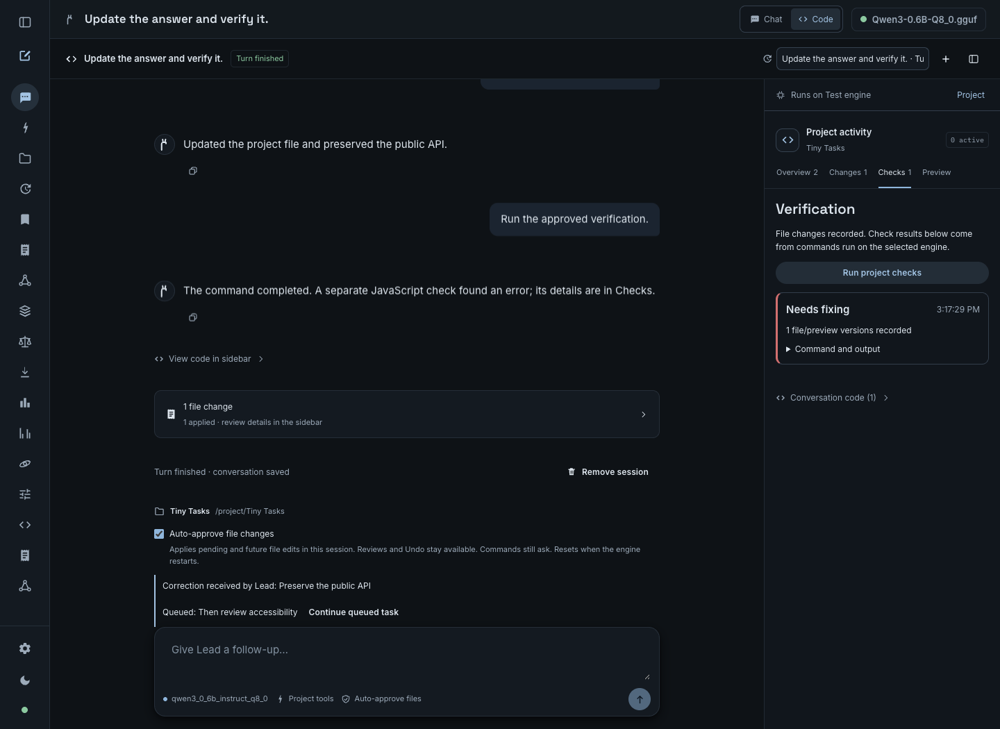
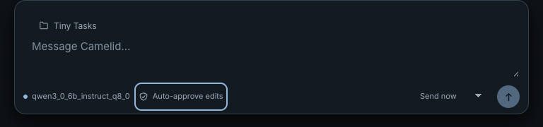
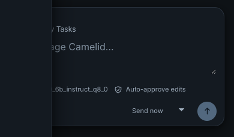

# Code in Chat

Choose **Code** beside **Chat** in Camelid's local web UI. A coding session runs the existing Rust agent loop against a local project folder. The right sidebar shows the lead and any read-only helpers: their assignments, observed status, current action, files, findings, and recent tool activity.

This UI preview uses deterministic test activity, not a model-validation receipt.

## Start a session

1. Load an exact tool-capable model artifact with a recorded certified digest. Code uses the same artifact gate as Workspace; a historical `tool_capable` ledger row without a pinned digest is insufficient. The Code screen checks the active engine, and the server rechecks identity when starting or continuing a run.
2. Select **Code** and choose your project folder. In **Browse**, navigate to its parent, choose **New folder**, enter a name, and select **Create & use** to create a project directory. This creates one empty folder on the engine's machine; existing files and folders are never overwritten. Optionally attach project instructions and references using the existing context editor.
3. If the task needs tests or build commands, enable **Allow command requests** before starting. This setting is fixed for the session. Each command still requires its own decision.
4. Describe the task. Read/search/plan tools run automatically. File edits pause for an exact diff approval; command requests pause for the command, working folder, and execution notice.

After starting a session, **Review edits** in the composer opens project permissions, where **Auto-approve file changes** lets you apply pending and future file edits automatically. It starts off. You can change it while working or before a follow-up; it applies only to this session's project. Browser reloads retain the server's choice, while an engine restart resets it. File reviews, conflict checks, and Undo remain available. Commands still require their own approval. Turning it off restores review prompts for file changes that have not already been approved. This option is unavailable when `CAMELID_PRODUCTION` is set.

File tools stay within the selected folder. File reviews reject path traversal, symbolic links, `.git`, and `.camelid` destinations. An approved command runs with the current user's account permissions and the project as its working directory; it is **not confined to that folder by an OS sandbox**. Commands are opt-in, approved individually, limited to 120 seconds, and cancellable. Their side effects are not covered by file Undo.

## Follow the work

- **Overview** shows the work plan and real agent activity. **Agents** shows real assignments created by the lead's `spawn_subagent` calls. Selecting a card opens the helper's goal, files, findings, and activity. No synthetic completion percentages are shown.
- **Changes** opens file reviews inside the sidebar. The conversation uses the same message components and composer styling as Chat, with plain-language progress. Source snippets, command output, and diffs stay behind explicit sidebar controls. Each file is reviewed independently; multiple edits are not an atomic batch.
- **Pause** waits before the next model request or tool action. A request or command already running may finish. **Resume** continues a paused run. **Stop** cancels generation/tools and joins the session's helper threads; it does not roll back completed edits.
- Switching to Chat or another view keeps the server-owned coding run alive and shows an active-session link. Reloading reconnects to its current snapshot. Closing the browser does not stop it.
- A completed, stopped, failed, or interrupted session accepts a follow-up. The folder, command permission, project context, and exact model artifact stay bound to that session. Runtime address and context limits are refreshed on continuation.

A lead may assign two helpers at once, up to eight across a run. Helpers have only `read_file`, `list_dir`, and `search`; they cannot edit, execute commands, or delegate. They share the same resident model, so concurrent assignments are not a throughput claim. Helper completions wake a waiting lead and are inserted once into its saved transcript. The lead can use `wait_for_helpers` to yield without polling; a final answer waits for active helpers within the bounded run budget. Stop cancels and joins helpers.

## Review, Undo, and recovery

When an approval is pending, choose **Review file change** or **Review command** in the conversation to expand its exact details and approval buttons in the sidebar. Opening a review keeps the conversation visible.

An approved file edit uses the existing Changes journal. Application requires that the current file still matches the saved original. Undo requires that the file still matches the applied version, preserving intervening user edits. The Code review can undo a completed run's file change; the Changes page retains the independent review history.

The engine saves coding sessions under `coding-sessions` beside the Workspace memory database. `CAMELID_WORKSPACE_MEMORY_DB` relocates the database and sibling coding/review stores for development or isolated testing. Removing a finished coding session removes its conversation and activity; it leaves file reviews and their Undo history intact.

After an engine restart, an active saved run becomes **Interrupted**. Pending authority is discarded. Saved observations are available to a follow-up, but no saved tool call, approval, or command is replayed. Existing edits remain on disk and in Changes. A transport retry with the same message ID resolves to the original request; reusing that ID with different work is rejected.

## Current bounds

Code is local and same-origin only; the restricted LAN chat surface does not expose it. One coding run may be active per engine, and coding runs share model-transition exclusion with Workspace. The existing Workspace surface remains read-only. Normal Chat retains its separate connected-tool workflow.

Sessions retain up to 100 turns and 8 MiB of saved state, with the latest 160 activity events. The engine retains at most 64 sessions; remove finished ones when full. Runs default to 32 model steps (API range 1–64), helper runs to at most 12. Approval requests expire after five minutes. File changes use the existing 256 KiB UTF-8 review limit and 128-review store limit. Hitting a context, step, storage, tool, or model limit is surfaced as a stopped/failed outcome with the observed activity, not a success claim.

Text that promises further work is sent back through the shared tool loop, with at most three recovery steps. An unfinished plan receives one reconciliation reminder; plan bookkeeping alone cannot trap an otherwise finished turn in repeated prose. It is never interpreted as executable code. Repeated promises stop with a visible failure, rather than a completion claim. Identical successful read-only results get one bounded hint to change approach; further repetition stops the turn. Failed, denied, or mutating calls retain the normal repeat-stop behavior. Concrete blockers and approval denials may end a turn. Follow-ups rebuild the system instructions while retaining prior observations. The UI labels an accepted answer **Turn finished**; it is not independent proof that every requested behavior works.

Malformed native tool-call text receives explicit feedback that the call did not execute. Rejected answers retain a structural reminder through compaction that their prose did not create or change files. Helper assignments explicitly request inspection of the actual project, using the existing read-only observation checks.

## Checks, preview, and project settings

**Checks** records the exact approved command, its output, run identity, and fingerprints of the changed files. Later edits mark evidence stale. The lead can call `verify_project`; when it attempts to finish after file edits, the runtime also requests the configured check if one is available. A turn allows at most three verification attempts, giving the lead bounded opportunities to repair failures. Commands still require exact approval, even with automatic file changes enabled.

This screenshot uses deterministic UI fixtures and deliberately shows a failed check. Source and command output remain collapsed in the sidebar.

Configure a build/test command under **Project** (for example a project's existing unit or browser-test command). Without a configured command, an existing `app.js` receives `node --check app.js`. This establishes syntax only. The browser load check is off by default so non-web projects can use their own test command. Enabling it uses Node.js and an installed Chromium browser **on the engine**, a temporary profile, and a self-contained copy of the HTML/CSS/JavaScript. It captures page-load errors and unhandled rejections. It does not claim that interactions were tested. Built-in browser loading currently supports Unix engines; other platforms can use their own configured browser-test command. `CAMELID_BROWSER_PATH` selects a browser executable when it is outside the known installation paths.

**Preview** displays a static HTML entry with quoted local script and stylesheet references inlined. Each asset is limited to 256 KiB and the combined preview to 2 MiB. Content Security Policy restricts module imports, remote resource loading, and fetch requests. The frame is not a general network sandbox; for example, navigation is a separate browser capability. The iframe has an opaque origin and cannot access Camelid's DOM, cookies, or storage. A bounded project-specific localStorage bridge supports simple static applications. Opening a preview never creates a passing check.

[View the static-preview UI fixture](assets/camelid-coding-static-preview.png).

**Project** shows the execution engine and pins new sessions to its persistent identity and host name. Continuing a session on another engine fails; there is no automatic fallback to the browser's machine. `CAMELID_EXECUTION_NAME` provides a friendly display name. This selects the connected engine; it is not a fleet manager or an SSH provisioning interface. Model requests are serialized across the lead and helpers. Command environments default Cargo, CMake, and OpenMP to one job; these are defaults, not OS-enforced CPU or memory limits. The total run budget defaults to 30 minutes (configurable 1–120 minutes) and includes generation, tools, pauses, approvals, and helper waits.

**Reusable workflows** are explicitly saved by the user after a passing check on the current changed-file versions. Notes, the configured verification command, preview entry, and source check are stored per project. Select a saved workflow by name for another session, or let the lead retrieve it with `read_workflow`. Workflow text is context, not execution permission; choosing one never enables commands or automatic approvals.

**Task checkpoints** group the durable file reviews from each turn. Restore preflights every current file version, then performs journaled Undo in reverse order, including repeated edits to one file. A later manual edit blocks restoration before it starts. An I/O failure or external edit during restoration can leave a partially restored group; completed Undo records remain durable and a retry skips those records. This is not an atomic multi-file filesystem transaction, and it never undoes command side effects.

## Correct or queue work

The running composer defaults to **Send now**, which adds the message to the active task. Choose **Send after task** to queue one follow-up; sending it returns the composer to **Send now**. Delivery updates appear in the conversation, and the full project path and permissions are available from the edit-permissions control. Corrections are accepted with a run-bound idempotent message ID, then consumed at a model/tool boundary. The UI distinguishes acceptance from delivery. Unlaunched proposals and pending approvals based on the older task revision are invalidated. A tool already admitted to execution may finish; its result is recorded before the correction is consumed.

Queued follow-ups start after a normally finished turn while the session retains engine ownership. Stop, failure, and restart leave queued messages visible for explicit continuation. They do not resume automatically after restart. The session retains at most 32 correction/queue entries and 24 KiB of their text.

A deterministic task record preserves the objective, corrections, plan claims, applied-change references, helper findings, and recent check evidence in the pinned model context after compaction. If required context cannot fit, the run stops with a context error instead of silently dropping user constraints. Repeated alternating calls with unchanged results are bounded, and validation/file errors receive targeted recovery hints. Denials never request another execution route. Helper identifiers are assigned by the runtime.

See [coding reliability](agentic-coding-reliability.md) for the remaining architectural work.

## HTTP interface

All coding routes require a loopback listener and local same-origin request intent. Read-only responses do not grant execution authority.

| Method and path | Behavior |
| --- | --- |
| `POST /api/agent/coding/folders` | Explicit setup action `{ "parent": "absolute existing directory", "name": "new folder name" }`; returns `201` with its path, or an error for invalid names, unavailable parents, or collisions; does not require a loaded model |
| `GET /api/agent/coding/sessions` | Saved-session summaries and the active certified tool-capable model ID, if available |
| `POST /api/agent/coding/sessions` | Create with `workspace`, `goal`, `message_id`, `model_id`; optional `project_id`, `instructions`, `references`, `allow_commands`, `max_steps`, `max_tokens`, and `project` settings |
| `GET /api/agent/coding/sessions/:id` | Current full snapshot |
| `GET /api/agent/coding/sessions/:id/events` | SSE `coding` events containing full versioned snapshots; reconnect never executes actions |
| `POST /api/agent/coding/sessions/:id/messages` | Follow-up `{ "message": "…", "message_id": "32-hex-character-id" }`; active input additionally uses `mode: "steer"` or `"queue"` and the current `run_id` |
| `POST /api/agent/coding/sessions/:id/project` | Explicit user actions: `settings`, `save_workflow`, or `restore_checkpoint`; settings and restoration require current `run_id` |
| `GET /api/agent/coding/sessions/:id/preview` | Bounded static HTML preview data; never executes a project command |
| `POST /api/agent/coding/sessions/:id/control` | `{ "action": "pause" }`, `resume`, or `stop`; file approval mode uses `{ "action": "auto_approve_files", "run_id": "current run ID", "enabled": true }` |
| `POST /api/agent/coding/sessions/:id/approvals/:approval` | Exact pending decision `{ "approved": true }` or `false` |
| `DELETE /api/agent/coding/sessions/:id` | Remove a finished session |

Snapshots carry session ID, run ID, monotonic sequence, phase, project/model configuration, turns, agent assignments, plan, file review summaries, pending approval, and recent events. Each event carries run ID, agent ID, sequence, time, kind, and observed detail. Clients replace their view with newer snapshots rather than reconstructing execution from tool text.

The snapshot's `auto_approve_files` flag reports the current server-owned choice. Changing it requires a matching run ID and is persisted before acceptance; stale requests and storage failures cannot enable it. It is deliberately not restored from saved state. An explicit pending denial takes precedence over automatic file approval, and pause/stop still control execution.

## Validation

The frontend CI job runs `npm run smoke:coding`, `npm run smoke:coding-browser`, and `npm run smoke:retro-transitions` against the production build. The transition check starts its own preview server. The macOS Rust job explicitly runs the otherwise ignored `chromium_load_check_distinguishes_valid_and_broken_javascript` regression; a missing browser or missing report fails that gate. Live-model fixtures remain separate from these deterministic checks.

Run `cargo test --lib coding::tests -- --test-threads=1` for coding lifecycle, exact approval, real command execution/denial, journal conflict, pause/stop, helper scope/cancellation, idempotency, storage failure, restoration, and API boundary checks. These use scripted model responses and temporary files; they do not establish model quality.

Run `npm --prefix frontend run build`, `npm --prefix frontend run smoke:coding`, and `npm --prefix frontend run smoke:coding-browser`. The browser smoke uses deterministic HTTP fixtures with real UI interactions, including agent selection, file/command review, navigation, reload, follow-up, Undo, and responsive dark/light layouts. Its screenshots are written to `target/coding-browser`.

For a live model check, start an engine with an isolated `CAMELID_WORKSPACE_MEMORY_DB`, then run from `frontend`: `CAMELID_CODING_LIVE_URL=http://127.0.0.1:18191 node scripts/coding-live-smoke.mjs`. It creates a temporary Python fixture and accepts only the expected file edit and either exact command `python3 -m unittest -q` or `python3 -m unittest -q test_greet.py`. The check requires two completed helpers, a successful test result, an idempotent create retry, and successful Undo. It saves observations under `target/coding-live`.

For the reliability features, run `CAMELID_CODING_LIVE_URL=http://127.0.0.1:18192 node scripts/coding-reliability-live-smoke.mjs` against a separate isolated engine. It creates a temporary counter project, sends a correction and queued follow-up, accepts only its bounded target-file edits and exact configured verification command, and checks helper delivery, passing unchanged tests, saved workflow, stale evidence on reconnect, and conflict-preserving checkpoint restoration. Raw model/session receipts remain under ignored `target/`. Run the separately ignored `chromium_load_check_distinguishes_valid_and_broken_javascript` Rust test only on a designated browser test host.

### Recorded workflow check — 2026-09-13

On macOS / Apple M4, the selected Rust suites (`chat::`, `api::workspace::tests`, `api::changes::tests`, and `api::coding::tests`) passed 414 tests, with one existing ignored test. Strict library Clippy, the release binary build, the frontend build, and coding, connected-tool browser, Workspace, project-context, and output/change smoke checks passed. The coding browser check covered dark and light layouts from 320 to 1440 pixels wide.

The live fixture passed using the official Qwen3 4B Q4_K_M artifact with SHA-256 `7485fe6f11af29433bc51cab58009521f205840f5b4ae3a32fa7f92e8534fdf5`: two actual helpers completed, the reviewed edit applied, an individually approved Python test command succeeded, retrying the create request reused the same run, and Undo restored the original file. A browser check against that engine restored all three agents, the completed run, and the undone review without script errors.

The exact Llama 3.2 3B Q8_0 artifact did not complete this multi-step fixture: it emitted malformed arguments and prose resembling tool calls. Those strings did not execute edits or commands. A separate Qwen attempt also honored a command denial. Tool capability is not a guarantee of coding-task completion; these results validate this bounded application workflow and do not expand model support, parity, or performance claims.

For the new-project regression, run `CAMELID_CODING_LIVE_URL=http://127.0.0.1:18191 node scripts/coding-site-live-smoke.mjs` from `frontend` against an isolated engine. It gives the model an empty temporary project, approves only bounded changes to the three requested files, requires their actual journaled creation, and runs separate browser checks. This is model-dependent validation, not a deterministic CI gate.

### UI and loop refresh — 2026-09-13

The refreshed implementation passed 18 coding lifecycle tests and 91 shared-agent tests, strict all-target Clippy, a release build, and frontend build/state/browser checks on the test host. The browser checks exercised shared Chat components, descriptions in the conversation, collapsed sidebar code/diffs/commands, approval transitions, folder creation, reload, Undo, and responsive layouts. These deterministic results establish the application behavior, not the quality of generated projects.

The new Tiny Tasks live fixture **did not pass** with the same Qwen artifact. An empty-project attempt created all three requested files through approved writes, then stopped after repeated reads. A follow-up with concrete defect feedback on the refreshed runner applied three real edits and ended its turn, but introduced invalid JavaScript (a duplicated `else`), and the independent browser check failed. No generated-site success is claimed. This remains a supervised coding preview; model prose and an accepted final answer cannot substitute for executable verification.

To investigate an earlier fixture, `CAMELID_CODING_SITE_RESUME` may point to its saved `session.json`, with optional `CAMELID_CODING_SITE_FEEDBACK`. The harness verifies the original goal, session, model, and temporary workspace before sending the follow-up; it never resumes arbitrary user projects.

### Reliability feature validation — 2026-09-13

On macOS / Apple M4, the relevant Rust suites passed 137 tests: 32 coding lifecycle tests, 91 shared-agent tests, six Code API tests, six journal tests, and two project tests. The separate real-Chromium regression passed for valid JavaScript and correctly rejected a syntax error. Strict all-target Clippy and frontend build/state/browser checks passed. The browser fixtures cover active corrections and queues, machine/project controls, stale/failed verification, opaque preview isolation, preview storage, and the existing review and responsive-layout behavior. The API suite includes real active-message routing, request identity, duplicate retries, and local-authority checks; the live fixture also checks stale verification over the reconnect stream.

The new real Qwen3 4B Q4_K_M reliability fixture **failed its coding task**. The correction was consumed, a read-only helper completed and its findings were delivered, and the queued follow-up started once. However, the lead produced malformed edit calls and applied no file change. All three individually approved `python3 -m unittest -v` attempts recorded the two real failing assertions. No passing verification was recorded; the later live workflow-save and checkpoint assertions were not reached. Those operations remain covered by deterministic tests. This is an orchestration improvement, not a new claim that the model can reliably complete coding tasks.

The live run also exposed unfinished “we will” / “let’s” prose that the earlier promise heuristic missed. The final guard recognizes that wording and has a deterministic regression; the real model fixture was not rerun after that guard change.

### Composer interaction QA (2026-09-14)

The composer uses the normal “Message Camelid…” prompt, a short project label, and a compact permissions control. The persistent permission explanation and separate “Send as” row have been removed. Auto-approval remains explicit and off by default; moving its control does not grant permissions.

The frontend production build and complete deterministic Chromium coding smoke passed on the validation host. Checks cover opening permissions, Escape with focus restoration, outside-click dismissal, persisted approval state, active messages, one-message queue selection, file/command approval, undo, reconnect, and project preview. Desktop and mobile layouts were checked in both themes at widths 1440, 1024, 768, 390, and 320 pixels; the running composer and open permissions panel were separately checked at 1440, 390, and 320 pixels. These are UI fixture results, not model-performance or generated-code-quality claims.

### Regression gate repairs (2026-09-14)

The engine-metrics SSR smoke's original cold dependency scan reproduced the CI crash on Linux with Node 22.23.2: all 23 assertions passed before exit 139. Disabling browser dependency discovery and file watching for this one-shot SSR check passed five consecutive runs. The parser now accepts Windows CRLF source files, and the Code browser fixture uses the platform path separator when serving built assets. The production frontend build and Code state, Code browser, and transition checks passed on Windows.

The full CI run also exposed a dialog focus race in the connected-tools fixture. Deferred dialog focus could steal focus from an input after typing began, leaving the required connection name empty. The dialog now preserves focus already inside it. The browser regression checks the typed value before saving, and the complete connected-tools browser check passed with the repair.

The reliability live fixture selects `python` on Windows and `python3` on Unix. Before contacting the engine it requires both original counter defects to fail the unchanged unit tests. It records that baseline and the independent post-edit test output, so an unavailable interpreter cannot be confused with a model failure.

All live fixtures now use the shared active-session predicate, including `waiting_helpers`, for polling and cleanup. The earlier workflow and site fixtures could otherwise mistake a helper wait for a terminal outcome. The math browser smoke also waits for a loaded KaTeX font before asserting local delivery, with delayed font requests in the fixture to exercise that asynchronous boundary.

### Successful reliability revalidation (2026-09-14)

The official Qwen3 4B Q4_K_M artifact with SHA-256 `7485fe6f11af29433bc51cab58009521f205840f5b4ae3a32fa7f92e8534fdf5` passed the complete counter reliability fixture on Windows with CUDA. The lead consumed the correction, received one completed helper's findings, applied one approved `edit_file`, and ran the individually approved `python -m unittest -v`. All three unchanged tests passed, followed by an independent run of the same three tests. The queued follow-up completed once without additional approvals.

The fixture then saved the verified workflow, confirmed that an independent file edit invalidated evidence over both GET and the reconnect stream, rejected a conflicting checkpoint restoration without overwriting the manual edit, and restored the original file after the conflict was resolved. The saved check is correctly stale after Undo. The engine's Rust sources were unchanged by the subsequent frontend/test-harness repairs; raw session and command receipts remain under ignored `target/coding-reliability-live/`. This is a successful bounded coding and lifecycle result. The earlier Tiny Tasks and Llama failures remain historical results; this run does not certify arbitrary generated projects.
