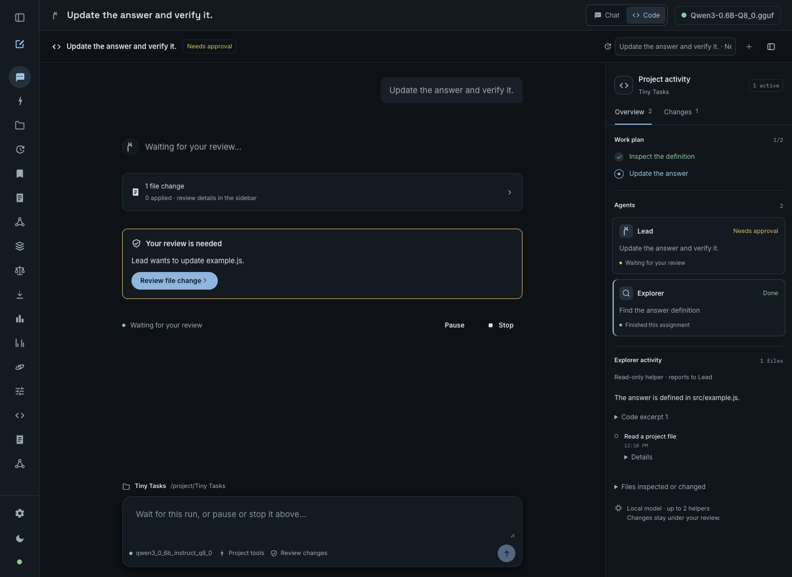

# Code in Chat

Choose **Code** beside **Chat** in Camelid's local web UI. A coding session runs the existing Rust agent loop against a local project folder. The right sidebar shows the lead and any read-only helpers: their assignments, observed status, current action, files, findings, and recent tool activity.

This UI preview uses deterministic test activity, not a model-validation receipt.

## Start a session

1. Load an exact tool-capable model artifact with a recorded certified digest. Code uses the same artifact gate as Workspace; a historical `tool_capable` ledger row without a pinned digest is insufficient. The Code screen checks the active engine, and the server rechecks identity when starting or continuing a run.
2. Select **Code**, choose your project folder, and optionally attach project instructions and references using the existing context editor.
3. If the task needs tests or build commands, enable **Allow command requests** before starting. This setting is fixed for the session. Each command still requires its own decision.
4. Describe the task. Read/search/plan tools run automatically. File edits pause for an exact diff approval; command requests pause for the command, working folder, and execution notice.

File tools stay within the selected folder. File reviews reject path traversal, symbolic links, `.git`, and `.camelid` destinations. An approved command runs with the current user's account permissions and the project as its working directory; it is **not confined to that folder by an OS sandbox**. Commands are opt-in, approved individually, limited to 30 seconds, and cancellable. Their side effects are not covered by file Undo.

## Follow the work

- **Agents** shows real assignments created by the lead's `spawn_subagent` calls. Selecting a card opens the helper's goal, files, findings, and activity. No synthetic completion percentages are shown.
- **Changes** links to the existing durable file reviews. Each file is reviewed independently; multiple edits are not an atomic batch.
- **Pause** waits before the next model request or tool action. A request or command already running may finish. **Resume** continues a paused run. **Stop** cancels generation/tools and joins the session's helper threads; it does not roll back completed edits.
- Switching to Chat or another view keeps the server-owned coding run alive and shows an active-session link. Reloading reconnects to its current snapshot. Closing the browser does not stop it.
- A completed, stopped, failed, or interrupted session accepts a follow-up. The folder, command permission, project context, and exact model artifact stay bound to that session. Runtime address and context limits are refreshed on continuation.

A lead may assign two helpers at once, up to eight across a run. Helpers have only `read_file`, `list_dir`, and `search`; they cannot edit, execute commands, or delegate. They share the same resident model, so concurrent assignments are not a throughput claim. Unfinished helpers are cancelled when the parent finishes.

## Review, Undo, and recovery

An approved file edit uses the existing Changes journal. Application requires that the current file still matches the saved original. Undo requires that the file still matches the applied version, preserving intervening user edits. The Code review can undo a completed run's file change; the Changes page retains the independent review history.

The engine saves coding sessions under `coding-sessions` beside the Workspace memory database. `CAMELID_WORKSPACE_MEMORY_DB` relocates the database and sibling coding/review stores for development or isolated testing. Removing a finished coding session removes its conversation and activity; it leaves file reviews and their Undo history intact.

After an engine restart, an active saved run becomes **Interrupted**. Pending authority is discarded. Saved observations are available to a follow-up, but no saved tool call, approval, or command is replayed. Existing edits remain on disk and in Changes. A transport retry with the same message ID resolves to the original request; reusing that ID with different work is rejected.

## Current bounds

Code is local and same-origin only; the restricted LAN chat surface does not expose it. One coding run may be active per engine, and coding runs share model-transition exclusion with Workspace. The existing Workspace surface remains read-only. Normal Chat retains its separate connected-tool workflow.

Sessions retain up to 100 turns and 8 MiB of saved state, with the latest 160 activity events. The engine retains at most 64 sessions; remove finished ones when full. Runs default to 32 model steps (API range 1–64), helper runs to at most 12. Approval requests expire after five minutes. File changes use the existing 256 KiB UTF-8 review limit and 128-review store limit. Hitting a context, step, storage, tool, or model limit is surfaced as a stopped/failed outcome with the observed activity, not a success claim.

## HTTP interface

All coding routes require a loopback listener and local same-origin request intent. Read-only responses do not grant execution authority.

| Method and path | Behavior |
| --- | --- |
| `GET /api/agent/coding/sessions` | Saved-session summaries and the active certified tool-capable model ID, if available |
| `POST /api/agent/coding/sessions` | Create with `workspace`, `goal`, `message_id`, `model_id`; optional `project_id`, `instructions`, `references`, `allow_commands`, `max_steps`, `max_tokens` |
| `GET /api/agent/coding/sessions/:id` | Current full snapshot |
| `GET /api/agent/coding/sessions/:id/events` | SSE `coding` events containing full versioned snapshots; reconnect never executes actions |
| `POST /api/agent/coding/sessions/:id/messages` | Follow-up `{ "message": "…", "message_id": "32-hex-character-id" }` |
| `POST /api/agent/coding/sessions/:id/control` | `{ "action": "pause" }`, `resume`, or `stop` |
| `POST /api/agent/coding/sessions/:id/approvals/:approval` | Exact pending decision `{ "approved": true }` or `false` |
| `DELETE /api/agent/coding/sessions/:id` | Remove a finished session |

Snapshots carry session ID, run ID, monotonic sequence, phase, project/model configuration, turns, agent assignments, plan, file review summaries, pending approval, and recent events. Each event carries run ID, agent ID, sequence, time, kind, and observed detail. Clients replace their view with newer snapshots rather than reconstructing execution from tool text.

## Validation

Run `cargo test --lib coding::tests -- --test-threads=1` for coding lifecycle, exact approval, real command execution/denial, journal conflict, pause/stop, helper scope/cancellation, idempotency, storage failure, restoration, and API boundary checks. These use scripted model responses and temporary files; they do not establish model quality.

Run `npm --prefix frontend run build`, `npm --prefix frontend run smoke:coding`, and `npm --prefix frontend run smoke:coding-browser`. The browser smoke uses deterministic HTTP fixtures with real UI interactions, including agent selection, file/command review, navigation, reload, follow-up, Undo, and responsive dark/light layouts. Its screenshots are written to `target/coding-browser`.

For a live model check, start an engine with an isolated `CAMELID_WORKSPACE_MEMORY_DB`, then run from `frontend`: `CAMELID_CODING_LIVE_URL=http://127.0.0.1:18191 node scripts/coding-live-smoke.mjs`. It creates a temporary Python fixture and accepts only the expected file edit and either exact command `python3 -m unittest -q` or `python3 -m unittest -q test_greet.py`. The check requires two completed helpers, a successful test result, an idempotent create retry, and successful Undo. It saves observations under `target/coding-live`.

### Recorded workflow check — 2026-09-13

On macOS / Apple M4, the selected Rust suites (`chat::`, `api::workspace::tests`, `api::changes::tests`, and `api::coding::tests`) passed 414 tests, with one existing ignored test. Strict library Clippy, the release binary build, the frontend build, and coding, connected-tool browser, Workspace, project-context, and output/change smoke checks passed. The coding browser check covered dark and light layouts from 320 to 1440 pixels wide.

The live fixture passed using the official Qwen3 4B Q4_K_M artifact with SHA-256 `7485fe6f11af29433bc51cab58009521f205840f5b4ae3a32fa7f92e8534fdf5`: two actual helpers completed, the reviewed edit applied, an individually approved Python test command succeeded, retrying the create request reused the same run, and Undo restored the original file. A browser check against that engine restored all three agents, the completed run, and the undone review without script errors.

The exact Llama 3.2 3B Q8_0 artifact did not complete this multi-step fixture: it emitted malformed arguments and prose resembling tool calls. Those strings did not execute edits or commands. A separate Qwen attempt also honored a command denial. Tool capability is not a guarantee of coding-task completion; these results validate this bounded application workflow and do not expand model support, parity, or performance claims.
